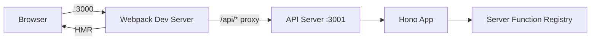

# Dev Server

## Command

```bash
ev dev
```

No flags needed — configuration comes from `ev.config.ts` or convention-based defaults.

## What It Does

`ev dev` starts **two servers** simultaneously:

| Server | Default Port | Purpose |
|--------|-------------|---------|
| **Webpack Dev Server** | `3000` | Client bundle with Hot Module Replacement (HMR) |
| **API Server** | `3001` | Server functions + route handlers, auto-started after first build |

The client dev server automatically proxies `/api/*` requests to the API server.



## Configuration

```ts
// ev.config.ts
import { defineConfig } from "@evjs/cli";

export default defineConfig({
  client: {
    entry: "./src/main.tsx",     // Default
    html: "./index.html",        // Default
    dev: {
      port: 3000,               // WDS port
      https: false,             // HTTPS mode
    },
  },
  server: {
    functions: {
      endpoint: "/api/fn",       // Default
    },
    backend: "node",             // Or "bun", "deno", etc.
    dev: {
      port: 3001,               // API port
      https: false,             // HTTPS for API server
    },
  },
});
```

## How It Works

1. `loadConfig(cwd)` loads `ev.config.ts` or returns convention-based defaults
2. `createWebpackConfig()` generates a webpack config (no temp files)
3. Starts `WebpackDevServer` for client HMR
4. On `compiler.hooks.done`, detects server bundle output
5. Auto-starts the API server via `@evjs/server/node`
6. Sets up reverse proxy: `devServer.proxy["/api"] → localhost:3001`

## Custom Backends

The `server.backend` field supports any executable:

- `"node"` (default) — uses `--watch` for auto-restart
- `"bun"` — passes args as-is
- `"deno run --allow-net"` — split on whitespace, extra args forwarded

:::warning

The ECMA environment adapter (`@evjs/server/ecma`) only exports a `{ fetch }` handler — it does **not** start a listening server. For `ev dev`, you **must** use a backend that starts an HTTP server (default: `"node"`).

:::

## Programmatic API

`ev dev` and `ev build` can also be used programmatically:

```ts
import { dev, build } from "@evjs/cli";

// Start dev server with custom config
await dev({ server: { dev: { port: 4001 } } }, { cwd: "./my-app" });

// Run production build
await build({ client: { entry: "./src/app.tsx" } }, { cwd: "./my-app" });
```

## Transport

`initTransport` is called automatically by `createApp()` to configure how the client communicates with the server.

- In **dev mode**: WDS proxies `/api/*` → `:3001`, so the default `/api/fn` endpoint works automatically
- In **production**: client and server are typically on the same origin
- The transport is **backend-agnostic** — the client always posts to the same endpoint regardless of server runtime
