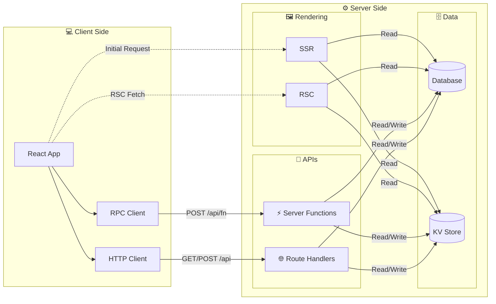

# What is evjs?

> **ev** = **Ev**aluation · **Ev**olution — evaluate across runtimes, evolve with AI tooling.

evjs is a zero-config React meta-framework built on [TanStack Router](https://tanstack.com/router), [TanStack Query](https://tanstack.com/query), and [Hono](https://hono.dev). It provides a seamless development experience for building type-safe, full-stack web applications.

## Features

- **Convention over Configuration** — `ev dev` / `ev build`, no boilerplate needed
- **Type-Safe Routing** — TanStack Router with full inference
- **Data Fetching** — TanStack Query with built-in proxies
- **Server Functions** — `"use server"` directive, auto-discovered at build time
- **Pluggable Transport** — HTTP, WebSocket, or custom via `ServerTransport`
- **Plugin System** — extend builds with custom module rules (Tailwind, SVG, etc.)
- **Route Handlers** — Standard Request/Response REST endpoints via `route()`
- **Typed Errors** — `ServerError` flows structured data from server → client
- **Multi-Runtime** — Hono-based server with Node, Deno, Bun, Edge adapters

## Full-Stack Architecture

