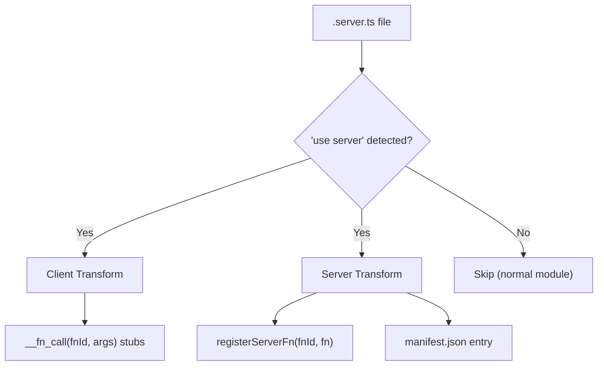

# Server Functions

Server functions let you write backend logic in `.server.ts` files and call them from React components as if they were local functions. The build system transforms them into RPC calls automatically.

## Basic Usage

```ts
// src/api/users.server.ts
"use server";

export async function getUsers() {
  return await db.users.findMany();
}

export async function createUser(name: string, email: string) {
  return await db.users.create({ data: { name, email } });
}
```

### Rules

- File must start with `"use server";` directive
- Only **named async function exports** are transformed
- Use `.server.ts` extension or place in `src/api/` directory
- No default exports — only named exports

## Query Patterns

evjs provides type-safe `useQuery` and `useSuspenseQuery` that accept server functions directly:

### Direct Usage (Recommended)

```tsx
import {
  useQuery,
  useSuspenseQuery,
  useMutation,
  useQueryClient,
  serverFn,
} from "@evjs/client";
import { getUsers, getUser, createUser } from "../api/users.server";

// Queries — pass server functions directly, types are inferred
const { data: users } = useQuery(getUsers);               // data: User[]
const { data: user } = useQuery(getUser, userId);          // data: User
const { data } = useSuspenseQuery(getUsers);               // data: User[] (guaranteed)

// Mutations — use raw TanStack useMutation
const queryClient = useQueryClient();
const { mutate } = useMutation({
  mutationFn: createUser,
  onSuccess: () => {
    queryClient.invalidateQueries({ queryKey: serverFn(getUsers).queryKey });
  },
});

// Route loaders / prefetching — use serverFn()
loader: ({ context }) =>
  context.queryClient.ensureQueryData(serverFn(getUsers));
```

### Mutation Arguments

```tsx
// Single argument: pass object directly
mutate({ name: "Alice", email: "alice@example.com" });

// Multiple arguments: pass as array
mutate(["Alice", "alice@example.com"]);
```

### Raw fetch / Non-Server Functions

For non-server functions, use the standard TanStack Query API directly:

```tsx
const { data } = useQuery({
  queryKey: ["github-user", username],
  queryFn: () =>
    fetch(`https://api.github.com/users/${username}`).then((r) => r.json()),
});
```

## Transport Configuration

### HTTP (Default)

```tsx
import { initTransport } from "@evjs/client";

initTransport({ endpoint: "/api/fn" });
```

### WebSocket

```tsx
import { WebSocketTransport } from "@evjs/client";
import { initTransport } from "@evjs/client";

initTransport({
  transport: new WebSocketTransport("ws://localhost:3001/ws"),
});
```

### Server Config

```ts
// ev.config.ts
import { defineConfig } from "@evjs/cli";

export default defineConfig({
  server: {
    functions: {
      endpoint: "/api/fn",  // default
    },
  },
});
```

## Error Handling

### Server Side

Throw structured errors with status codes and data:

```ts
import { ServerError } from "@evjs/server";

export async function getUser(id: string) {
  const user = await db.users.findById(id);
  if (!user) {
    throw new ServerError("User not found", {
      status: 404,
      data: { id },
    });
  }
  return user;
}
```

### Client Side

Catch typed errors:

```tsx
import { ServerFunctionError } from "@evjs/client";

try {
  const user = await getUser("123");
} catch (e) {
  if (e instanceof ServerFunctionError) {
    console.log(e.message);  // "User not found"
    console.log(e.status);   // 404
    console.log(e.data);     // { id: "123" }
  }
}
```

## Build Pipeline

At build time, the `"use server"` directive triggers two separate transforms:



- **Client build**: function bodies → `__fn_call(fnId, args)` stubs
- **Server build**: original bodies preserved + `registerServerFn(fnId, fn)` injected
- Function IDs are stable SHA-256 hashes from `filePath + exportName`

## Key Points

| Pattern | Usage |
|---------|-------|
| Query | `useQuery(fn, ...args)` |
| Suspense query | `useSuspenseQuery(fn, ...args)` |
| Loader / prefetch | `serverFn(fn, ...args)` → `{ queryKey, queryFn }` |
| Cache invalidation | `serverFn(fn).queryKey` |
| Arguments | Spread: `useQuery(getUser, id)` not `useQuery(getUser, [id])` |
| Server errors | `ServerError` on server → `ServerFunctionError` on client |
