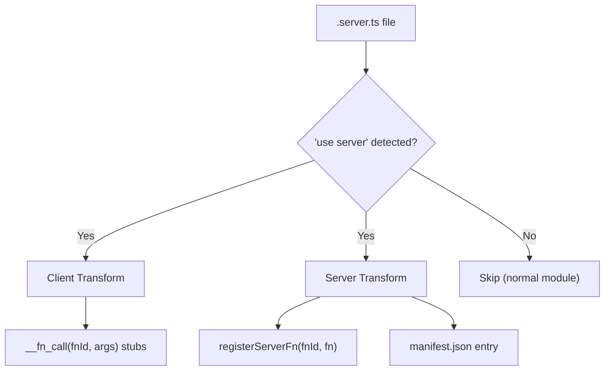

# Server Functions

Server functions let you write backend logic alongside your frontend code and call them from React components as if they were local functions. While not strictly required, we recommend suffixing server function files with `.server.ts`. The build system transforms them into RPC calls automatically.

## Basic Usage

```ts
// src/api/users.server.ts
"use server";

export async function getUsers() {
  return await db.users.findMany();
}

export async function createUser(name: string, email: string) {
  return await db.users.create({ data: { name, email } });
}
```

### Rules

- File must start with `"use server";` directive
- Only **named async function exports** are transformed
- **Recommendation**: Use the `.server.ts` extension (e.g. `users.server.ts`) or place them in a `src/api/` directory to help differentiate them from client code.
- No default exports — only named exports

## Query Patterns

evjs provides type-safe `useQuery` and `useSuspenseQuery` that accept server functions directly. Server function stubs also carry `.queryKey()`, `.fnId`, and `.fnName` properties for cache invalidation and introspection.

### Direct Usage (Recommended)

```tsx
import {
  useQuery,
  useSuspenseQuery,
  useMutation,
  useQueryClient,
  getFnQueryKey,
  getFnQueryOptions,
} from "@evjs/client";
import { getUsers, getUser, createUser } from "../api/users.server";

// Queries — pass server functions directly, types are inferred
const { data: users } = useQuery(getUsers);               // data: User[]
const { data: user } = useQuery(getUser, userId);          // data: User
const { data } = useSuspenseQuery(getUsers);               // data: User[] (guaranteed)

// Mutations — pass server functions directly, just like useQuery
const queryClient = useQueryClient();
const { mutate } = useMutation(createUser, {
  onSuccess: () => {
    queryClient.invalidateQueries({ queryKey: getFnQueryKey(getUsers) });
  },
});

// Route loaders / prefetching — use getFnQueryOptions()
loader: ({ context }) =>
  context.queryClient.ensureQueryData(getFnQueryOptions(getUsers));
```

### Server Function Metadata

Every registered server function stub carries these properties at runtime:

```ts
getFnQueryKey(getUsers)         // → ["<fnId>"]
getFnQueryKey(getUsers, someArg)// → ["<fnId>", someArg]
getUsers.fnId               // → "<hash>" (stable SHA-256)
getUsers.fnName             // → "getUsers"
```

- **`getFnQueryKey(fn, ...args)`** — Build a TanStack Query key. Use for `invalidateQueries`, `setQueryData`, etc.
- **`.fnId`** — The stable internal function ID (read-only).
- **`.fnName`** — The human-readable export name (read-only).
- **`getFnQueryOptions(fn, ...args)`** — Returns `{ queryKey, queryFn }` for loaders, prefetch, and `useInfiniteQuery`.

### Mutation Arguments

```tsx
// Single argument: pass object directly
mutate({ name: "Alice", email: "alice@example.com" });

// Multiple arguments: pass as array
mutate(["Alice", "alice@example.com"]);
```

### Raw fetch / Non-Server Functions

For non-server functions, use the standard TanStack Query API directly:

```tsx
const { data } = useQuery({
  queryKey: ["github-user", username],
  queryFn: () =>
    fetch(`https://api.github.com/users/${username}`).then((r) => r.json()),
});
```

## Transport Configuration

### HTTP (Default)

```tsx
import { initTransport } from "@evjs/client";

initTransport({ endpoint: "/api/fn" });
```

### Custom Transport (e.g., WebSocket)

Implement the `ServerTransport` interface for custom protocols:

```tsx
import { initTransport } from "@evjs/client";
import type { ServerTransport } from "@evjs/client";

const wsTransport: ServerTransport = {
  call: async (fnId, args) => {
    // Implement your WebSocket or custom protocol here
  },
};

initTransport({ transport: wsTransport });
```

### Server Config

```ts
// ev.config.ts
import { defineConfig } from "@evjs/ev";

export default defineConfig({
  server: {
    endpoint: "/api/fn",  // default
  },
});
```

## Error Handling

### Server Side

Throw structured errors with status codes and data:

```ts
import { ServerError } from "@evjs/server";

export async function getUser(id: string) {
  const user = await db.users.findById(id);
  if (!user) {
    throw new ServerError("User not found", {
      status: 404,
      data: { id },
    });
  }
  return user;
}
```

### Client Side

Catch typed errors:

```tsx
import { ServerFunctionError } from "@evjs/client";

try {
  const user = await getUser("123");
} catch (e) {
  if (e instanceof ServerFunctionError) {
    console.log(e.message);  // "User not found"
    console.log(e.status);   // 404
    console.log(e.data);     // { id: "123" }
  }
}
```

## Build Pipeline

At build time, the `"use server"` directive triggers two separate transforms:



- **Client build**: function bodies → `__fn_call(fnId, args)` stubs
- **Server build**: original bodies preserved + `registerServerFn(fnId, fn)` injected
- Function IDs are stable SHA-256 hashes from `filePath + exportName`

## Key Points

| Pattern | Usage |
|---------|-------|
| Query | `useQuery(fn, ...args)` |
| Suspense query | `useSuspenseQuery(fn, ...args)` |
| Mutation | `useMutation(fn)` or `useMutation(fn, { onSuccess })` |
| Cache invalidation | `getFnQueryKey(...args)` |
| Loader / prefetch | `getFnQueryOptions(...args)` → `{ queryKey, queryFn }` |
| Function metadata | `fn.fnId`, `fn.fnName` |
| Arguments | Spread: `useQuery(getUser, id)` not `useQuery(getUser, [id])` |
| Server errors | `ServerError` on server → `ServerFunctionError` on client |
