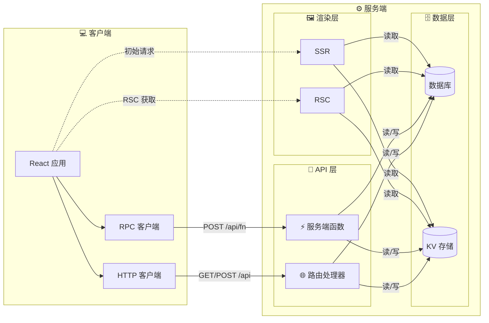

# 什么是 evjs？

> **ev** = **Ev**aluation（执行）· **Ev**olution（演进）—— 跨运行时执行，借助 AI 工具演进。

evjs 是一个零配置的 React 元框架，基于 [TanStack Router](https://tanstack.com/router)、[TanStack Query](https://tanstack.com/query) 和 [Hono](https://hono.dev) 构建。提供无缝的开发体验，用于构建类型安全的全栈 Web 应用。

## 特性

- **约定优于配置** —— `ev dev` / `ev build`，无需模板代码
- **类型安全路由** —— TanStack Router，完整的类型推导
- **数据获取** —— TanStack Query，内置代理
- **服务端函数** —— `"use server"` 指令，构建时自动发现
- **可插拔传输** —— HTTP、WebSocket 或通过 `ServerTransport` 自定义协议
- **插件系统** —— 通过自定义模块规则扩展构建（Tailwind、SVG 等）
- **路由处理器** —— 通过 `route()` 实现标准 Request/Response REST 端点
- **类型化错误** —— `ServerError` 将结构化数据从服务端传递到客户端
- **多运行时** —— 基于 Hono 的服务器，支持 Node、Deno、Bun、Edge 适配器

## 全栈架构

