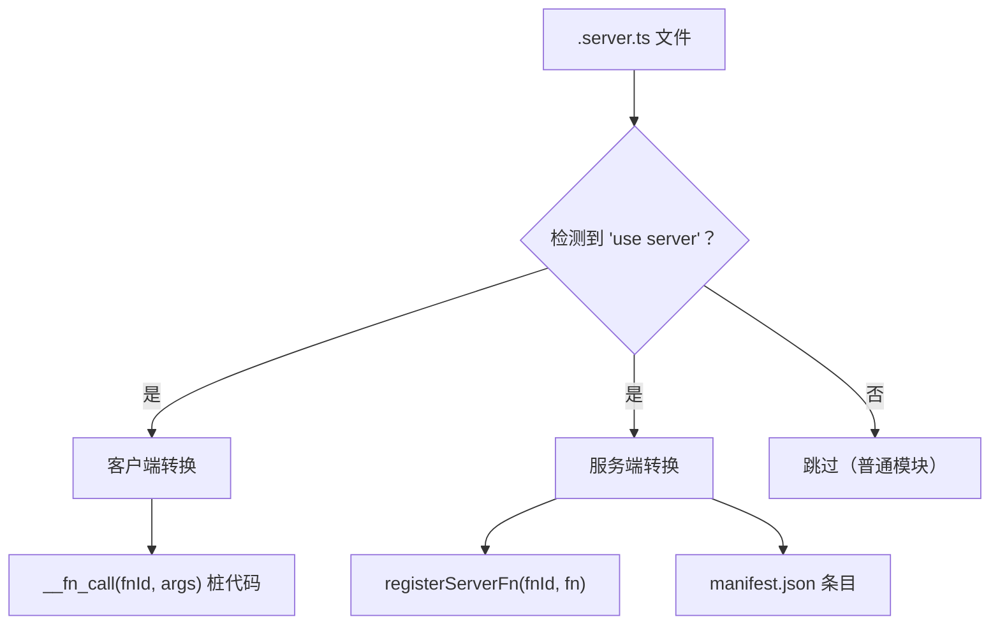

# 服务端函数

服务端函数允许你在与前端代码同源的地方编写后端逻辑，并在 React 组件中像调用本地函数一样调用它们。虽然我们不强制要求，但建议将服务端函数文件以 `.server.ts` 结尾。构建系统会自动将它们转换为 RPC 调用。

## 基本用法

```ts
// src/api/users.server.ts
"use server";

export async function getUsers() {
  return await db.users.findMany();
}

export async function createUser(name: string, email: string) {
  return await db.users.create({ data: { name, email } });
}
```

### 规则

- 文件必须以 `"use server";` 指令开头
- 只有 **命名的异步函数导出** 会被转换
- **推荐**：使用 `.server.ts` 扩展名（例如 `users.server.ts`）或将它们放在 `src/api/` 目录下，以帮助区分客户端代码。
- 不支持默认导出 —— 只支持命名导出

## 查询模式

evjs 提供类型安全的 `useQuery` 和 `useSuspenseQuery`，可直接接受服务端函数。服务端函数桩还携带 `.queryKey()`、`.fnId` 和 `.fnName` 属性，用于缓存失效和元信息获取。

### 直接使用（推荐）

```tsx
import {
  useQuery,
  useSuspenseQuery,
  useMutation,
  useQueryClient,
  getFnQueryKey,
  getFnQueryOptions,
} from "@evjs/client";
import { getUsers, getUser, createUser } from "../api/users.server";

// 查询 —— 直接传入服务端函数，类型自动推导
const { data: users } = useQuery(getUsers);               // data: User[]
const { data: user } = useQuery(getUser, userId);          // data: User
const { data } = useSuspenseQuery(getUsers);               // data: User[]（保证有值）

// 变更 —— 使用原始 TanStack useMutation
const queryClient = useQueryClient();
const { mutate } = useMutation({
  mutationFn: createUser,
  onSuccess: () => {
    queryClient.invalidateQueries({ queryKey: getFnQueryKey(getUsers) });
  },
});

// 路由加载器 / 预取 —— 使用 getFnQueryOptions()
loader: ({ context }) =>
  context.queryClient.ensureQueryData(getFnQueryOptions(getUsers));
```

### 服务端函数元信息

每个注册的服务端函数桩在运行时携带以下属性：

```ts
getFnQueryKey(getUsers)         // → ["<fnId>"]
getFnQueryKey(getUsers, someArg)// → ["<fnId>", someArg]
getUsers.fnId               // → "<hash>"（稳定的 SHA-256）
getUsers.fnName             // → "getUsers"
```

- **`getFnQueryKey(fn, ...args)`** — 构建 TanStack Query key。用于 `invalidateQueries`、`setQueryData` 等。
- **`.fnId`** — 稳定的内部函数 ID（只读）。
- **`.fnName`** — 可读的导出名称（只读）。
- **`getFnQueryOptions(fn, ...args)`** — 返回 `{ queryKey, queryFn }`，用于加载器、预取和 `useInfiniteQuery`。

## 传输配置

### HTTP（默认）

```tsx
import { initTransport } from "@evjs/client";
initTransport({ endpoint: "/api/fn" });
```

### 自定义传输（如 WebSocket）

实现 `ServerTransport` 接口以使用自定义协议：

```tsx
import { initTransport } from "@evjs/client";
import type { ServerTransport } from "@evjs/client";

const wsTransport: ServerTransport = {
  call: async (fnId, args) => {
    // 在这里实现你的 WebSocket 或自定义协议
  },
};

initTransport({ transport: wsTransport });
```

## 错误处理

### 服务端

抛出带状态码和数据的结构化错误：

```ts
import { ServerError } from "@evjs/server";

export async function getUser(id: string) {
  const user = await db.users.findById(id);
  if (!user) {
    throw new ServerError("用户未找到", {
      status: 404,
      data: { id },
    });
  }
  return user;
}
```

### 客户端

捕获类型化错误：

```tsx
import { ServerFunctionError } from "@evjs/client";

try {
  const user = await getUser("123");
} catch (e) {
  if (e instanceof ServerFunctionError) {
    console.log(e.message);  // "用户未找到"
    console.log(e.status);   // 404
    console.log(e.data);     // { id: "123" }
  }
}
```

## 构建管道

在构建时，`"use server"` 指令触发两个独立的转换：



## 要点总结

| 模式 | 用法 |
|------|------|
| 查询 | `useQuery(fn, ...args)` |
| Suspense 查询 | `useSuspenseQuery(fn, ...args)` |
| 缓存失效 | `getFnQueryKey(fn, ...args)` |
| 加载器 / 预取 | `getFnQueryOptions(fn, ...args)` → `{ queryKey, queryFn }` |
| 函数元信息 | `fn.fnId`、`fn.fnName` |
| 参数传递 | 展开传入：`useQuery(getUser, id)` 而不是 `useQuery(getUser, [id])` |
| 服务端错误 | 服务端 `ServerError` → 客户端 `ServerFunctionError` |
